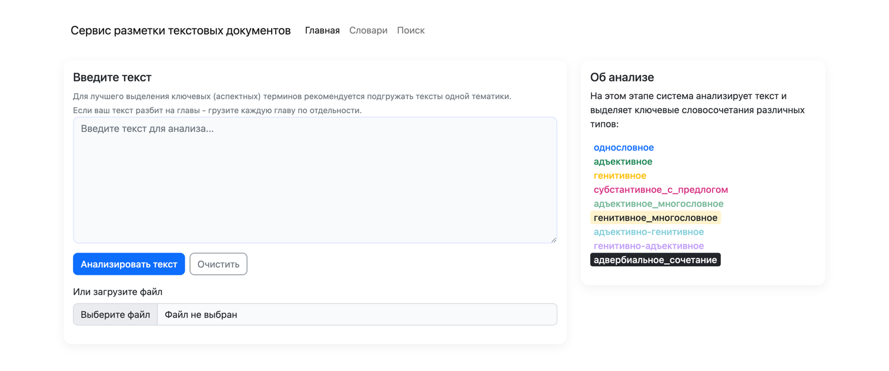

# NER app

## Описание

Сервис автоматизации разметки текстовых документов и поиска по размеченным документам.

## Зависимости
* python 3.13
* postgres 17

## Сборка и запуск проекта
- `docker compose up`
- `make init`

Проект доступен по http://127.0.0.1

## Команды
### Обновить зависимости python:
`make freeze`

### Работа с БД напрямую
#### После поднятия проекта проваливаемся в контейнер с postgres:
`docker compose exec postgres bash`

#### Заходим внутрь самого postgres в базу `ner`:
`psql ner --username=root`
