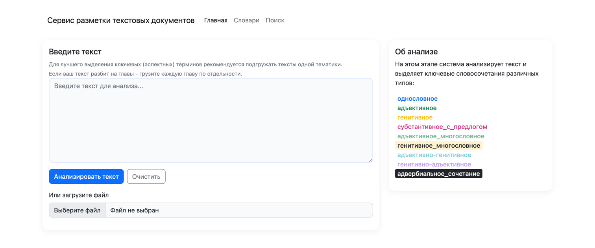

# NER app

**Тема:** "АВТОМАТИЗАЦИЯ ПРОЦЕССА РАЗМЕТКИ ТЕКСТОВЫХ ДОКУМЕНТОВ ВОПРОСНО-ОТВЕТНОЙ СИСТЕМЫ С РАЗМЕЧЕННОЙ КОЛЛЕКЦИЕЙ ДОКУМЕНТОВ".

**Выполнил:** Хмелевский Егор Дмитриевич, М9123-01.04.02пми

**Руководитель:** Остроухова Светлана Николаевна

## Описание

Сервис автоматизации разметки текстовых документов и поиска по размеченным документам.

## Требования
* python 3.13
* postgres 17
* Docker compose 2.*
* Make

## Запуск проекта
- `make .env`
- `docker compose up`

Проект доступен по http://127.0.0.1:8000
Документация к API - http://127.0.0.1:8000/docs

### Текстовые документы для тестирования работы системы
* Красная шапочка - `redhead.txt`
* Правила ПДД РФ, глава 2. Общие обязанности водителей - `pdd.txt`
* Дамп статьи про войну и мир с википедии - `war_and_peace_wiki_dump.txt`

## Вспомогательные команды
### Обновить зависимости python:
`make freeze`

### Работа с БД напрямую
#### После поднятия проекта проваливаемся в контейнер с postgres:
`docker compose exec postgres bash`

#### Заходим внутрь самого postgres в базу `ner`:
`psql ner --username=root`
